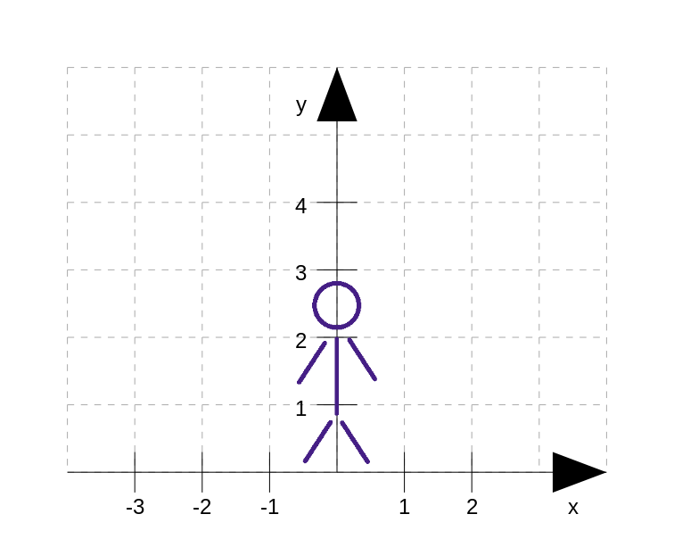

# Quickstart

Ever saw a wallmap on beatsaber and wondered.


__OH BOY DO I HAVE THE TOOL FOR YOU__

__Beatwalls__ is a program designed to make wallmaps with thousands of wall possible.
It tries to make them __easy and fast__ to create and change.

## Installation

### Tools

- install [java](https://java.com/en/download/)
- install [mma2](https://bsmg.wiki/mapping/mediocre-map-assistant.html#editor-setup)
- download [beatwalls](https://github.com/spookyGh0st/beatwalls/releases/latest)

### mods
::: tip Info
can be installed through modAssistant, 
or [manually](https://bsmg.wiki/pc-modding.html#install-mods)
:::

- required: [Noodle Extension](https://github.com/Aeroluna/NoodleExtensions) - allows for wallmaps
- recommended: [Chroma](https://github.com/Aeroluna/chroma) - lets you color your walls
- highly recommended: [FPFCToggle](https://github.com/DeadlyKitten/FPFCToggle) - lets you fly around the map without vr
- highly recommended: [MusicEscape](https://github.com/DeadlyKitten/MusicEscape) - lets you quit to menu and pause-menu with your keyboard
- highly recommended: [ReLoader](https://github.com/Kylemc1413/ReLoader) - hot reloads the map from the pause menu
- highly recommended: [PracticePlugin](https://github.com/Kylemc1413/PracticePlugin) - change Song time, playback speed and more from the pause manu

## Setup

It is __highly__ recommended using a sepate difficulty for your generated Walls.
This difficulty will hold all the walls (and bombs) that are being created.
For that, it will need the requirement `Noodle Extension`.
You can learn on how to set up the map on [bsmg.wiki](https://bsmg.wiki/mapping/extended-mapping.html#set-up).

::: warning Info
currently you have to copy the walls into the final version manually with json editing, 
this will change in the future
::: 

## Usage

Drag a Song Folder into the .exe to launch the configuration setup. 
It will create a .bw File in your song folder. Open this in any text editor. Recommended is Visual Studio Code.
This File defines the created Wallstructures for the selected difficulty, like a cookbook.

The next time you run beatwalls simply double-click the exe.
::: tip Info
When you want to change some settings or pick a different Song, you need to redo the step above
:::


## Overview

### WallStructure 

A WallStructure is a collection of walls. 
Bundling them together allows one to  edit and repeat them all at once to fit the Song, 
without having to manually edit each wall. 
In Beatwalls you only work with wallstructures.

### Wall

To make working with Walls easier, I introduce to you a new [standard](https://xkcd.com/927) of Values, which define a wall. It defines 1 = one block.



A wall is defined by `x,y,z,width,height,duration`
::: tip Info
`z` and `duration` are measured in beats.
Look at a different mapper (mma2) for those.
:::

[//]: # (TODO add picture)

## Hello Wall

Now let`s create our first Structure
Open Beatwalls and leave it running.
Now write this into you .bw file.

```
# creates a noodle Helix at beat 10
10 NoodleHelix
    count = 2
```

Lets see what happens in this example
 * Lines starting with a `#` are comments and get ignored.
 * `10 NoodleHelix` creates a NoodleHelix at beat 10. 
 NoodleHelix is one of the base Wallstructures.
 * `count = 2` is an assertion of the Property `count`
 With this line our NoodleHelix will create 2 helixe instead of one.
 
[//]: # (TODO explain this better)
 
:::tip
Wallstructures starting with `Noodle` often make use of features like localRotation or rotation
:::

Now open Beatsaber and reload with ctrl r.
Start your map, and you should see the Wallstructure appearing timed to beat 10
 
::: warning Timing
Beatwalls automatically makes sure your Wallstructures __apear__ and not zoom past you at the specific beat.
::: 

[//]: # (TODO add video)

## Specifics

- Beatwalls is ***NOT*** case-sensitive
- Beatwalls does ***NOT*** care about spaces or tabs, or any 
- Beatwalls does ***NOT*** work with non-ascii characters
- Beatwalls works with BEATS (the thing in mm) and not TIMES, so no need to worry about bpm changes
- Beatwalls has ***NO*** Syntax checker currently and might crash when something weird happens. Please write me when it does.
    